# Azure Resource Create
마이크로소프트 클라우드 서비스인 Azure 에서 사용할 필요 리소스들을 생성해보도록 하겠습니다. [Azure Portal](http://portal.azure.com)에 접속 후 로그인 하시기 바랍니다.

## 1. Resource Group 생성
1. Create a Resouce 클릭 후, Resource group 검색
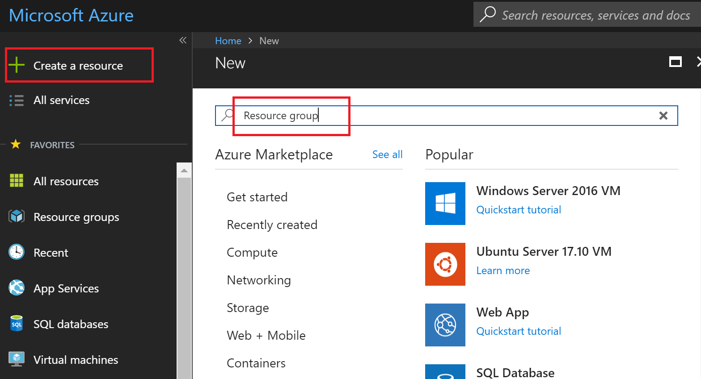

2. Create 버튼 눌러서 Resource group 생성
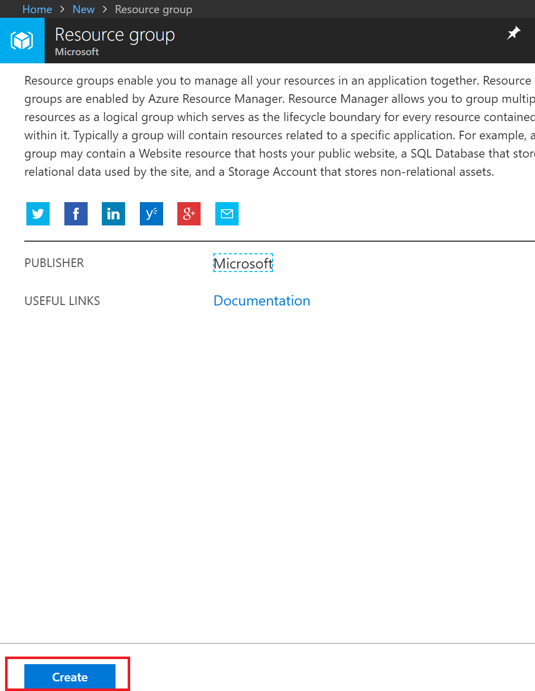

3. 아래와 같이 입력 후 Create 버튼 눌러서 생성
    * Resource group name: **face-hol-RG**
    * Subscription: (기본으로 설정된 구독, ex: Azure Pass)
    * Resource group location: **East Asia**

    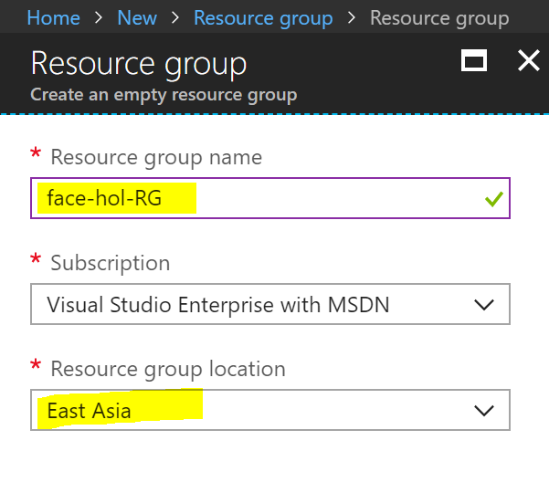

## 2. Face API 생성
1. Create a Resource 클릭 후, **face api** 검색
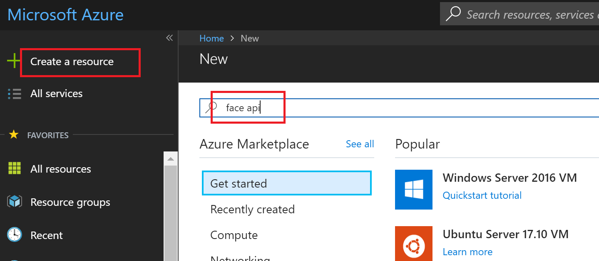

2. 목록에서 **Face API** 선택 후 Create 버튼 눌러서 생성
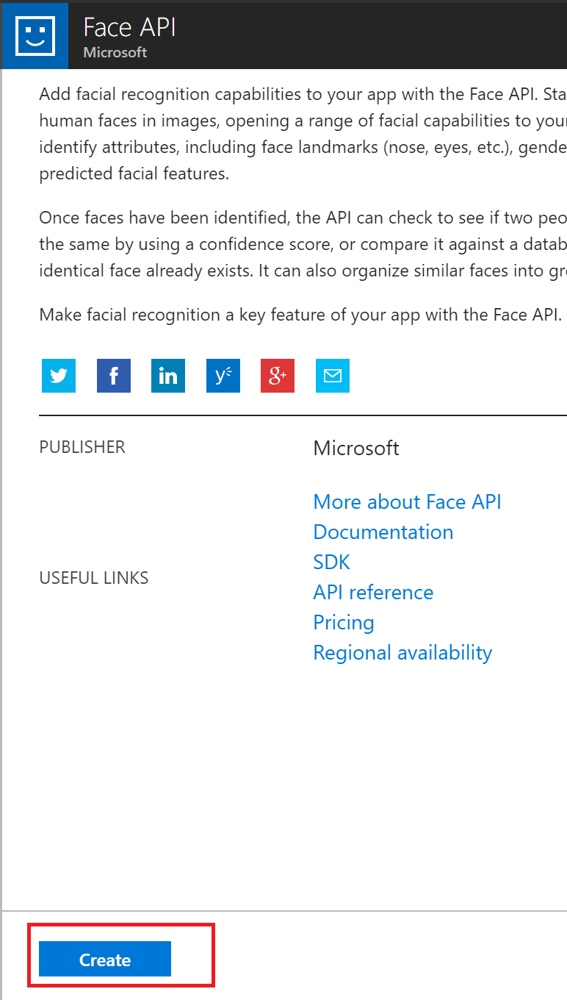

3. 아래와 같이 입력 후 Create 버튼 눌러서 생성
    * Name: **FaceAPI**
    * Subscription: (기본으로 설정된 구독, ex: Azure Pass)
    * Location: **East Asia**
    * Pricing Teir: s1
    * Resource group: Use existing -> **face-hol-RG** 선택

    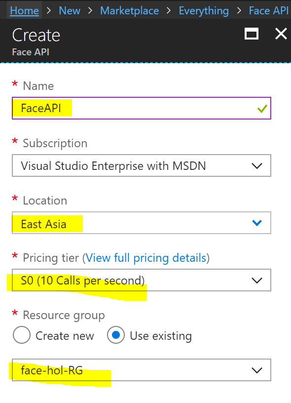

## 3. App Service Plan 생성
1. Create a Resource 클릭 후, **app service plan** 검색
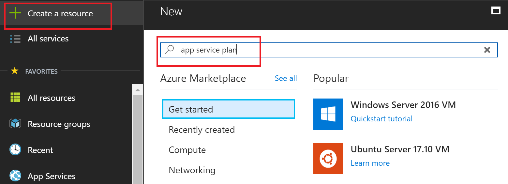

2. 목록에서 **App Service Plan** 선택 후 Create 버튼 눌러서 생성
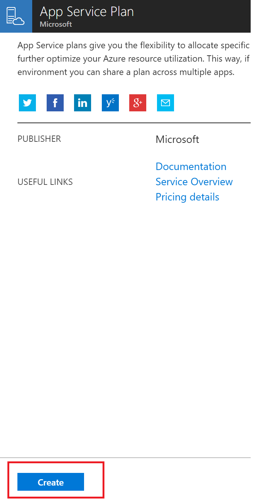

3. 아래와 같이 입력 후 Create 버튼 눌러서 생성
    * App Service Plan: **EastAsiaB1**
    * Subscription: (기본으로 설정된 구독, ex: Azure Pass)
    * Resource Group: Use existing -> **face-hol-RG** 선택
    * Operating System: Windows
    * Location: **East Asia**
    * Pricing tier: **B1 Basic**

    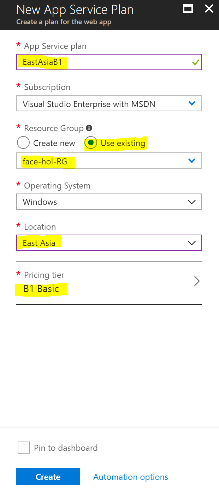

## 4. Azure Web App 생성 
1. Create a Resource 클릭 후, **web app** 검색
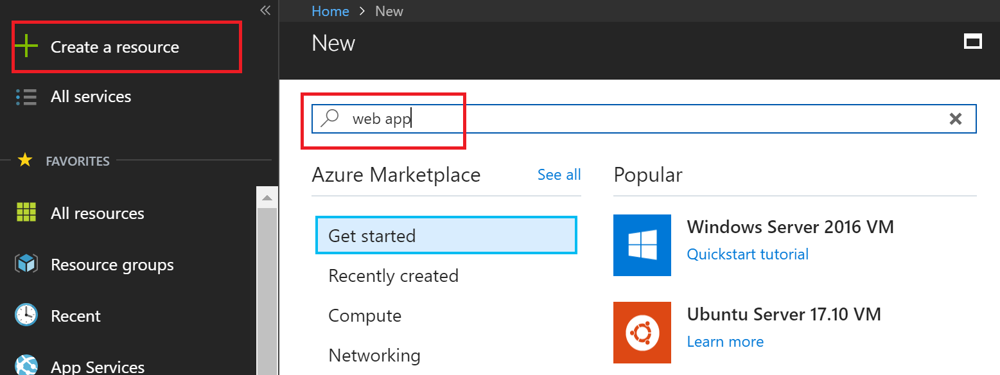

2. 목록에서 **Web App** 선택 후 Create 버튼 눌러서 생성
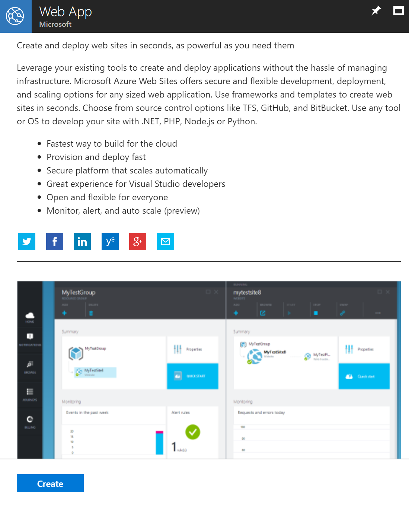

3. 아래와 같이 입력 후 Create 버튼 눌러서 생성
    * Name: **face-hol-자신의이니셜**
    * Subscription: (기본으로 설정된 구독, ex: Azure Pass)
    * Resource Group: Use existing -> **face-hol-RG** 선택
    * OS: Windows
    * App Service Plan/Location: **EastAsiaB1(B1)**
    * Application Insights: off    

    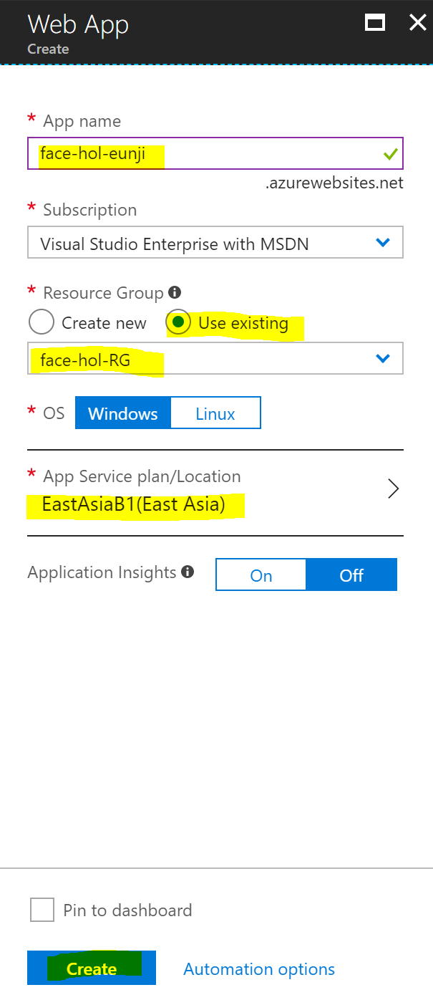

## 5. 생성된 Azure Resouce 확인 
1. Azure Portal 좌측 상단의 **Resourcec groups** 선택 후, 위에서 생성했던 **face-hol-RG** 리소스 그룹을 클릭한다. 

2. 위에서 생성했던 App Service Plan, Face API, Web App등을 차례로 확인할 수 있다. 
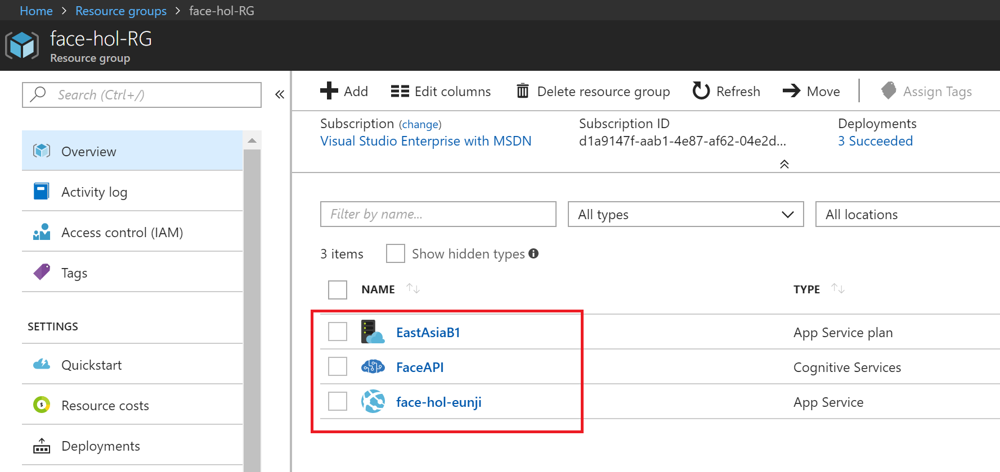

## 6. Face API의 Endpoint 및 Key 값 확인
1. 리소스 그룹 목록에서 **FaceAPI**를 선택한다.
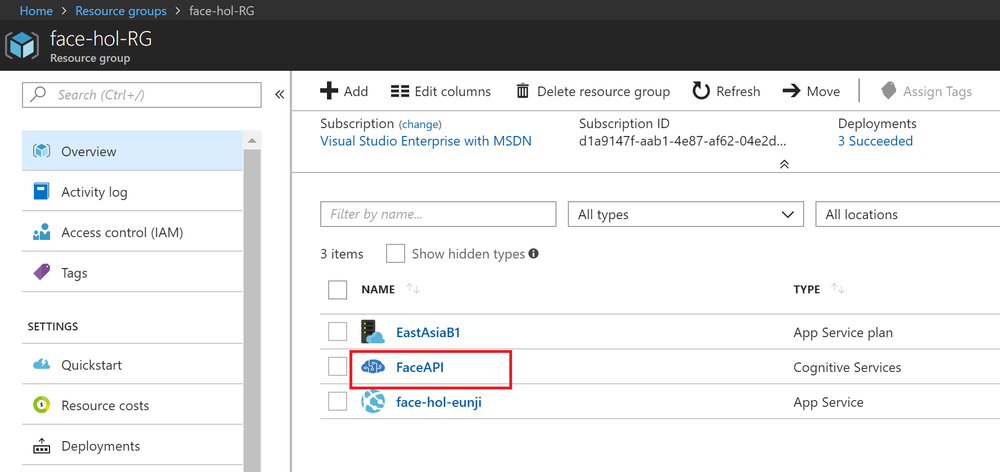

2. Overview를 선택하고 **Endpoint**를 확인한 후 메모장에 기록해둔다. 
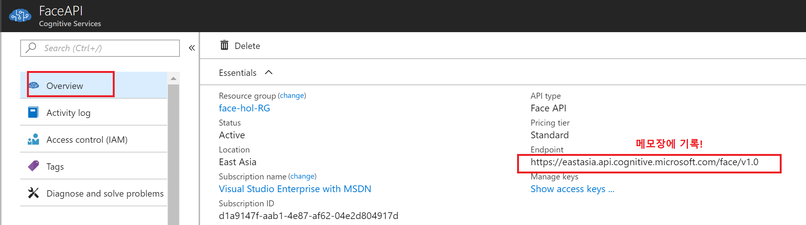

3. Keys를 선택하고 **KEY1**의 값을 메모장에 기록해둔다. 
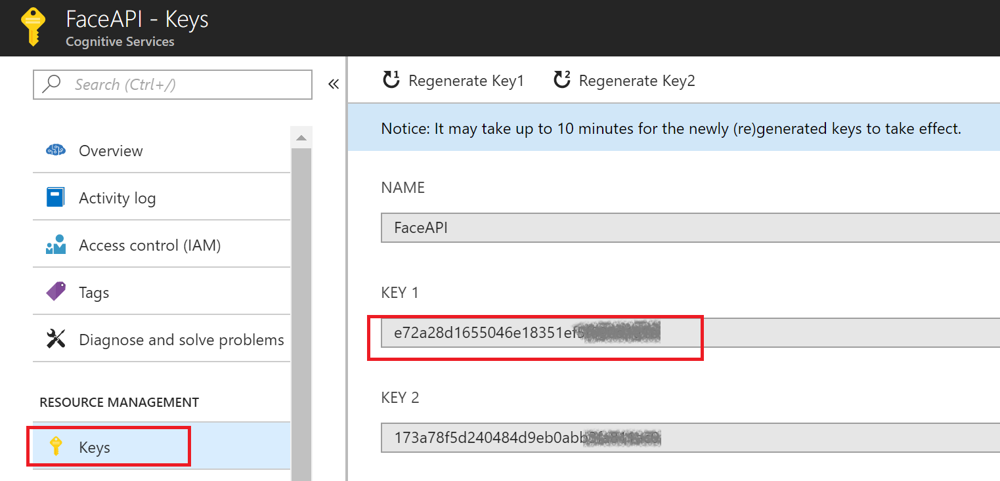

