# API Test
Microsoft에서 제공하는 [API Testing Console]() 및 API 테스팅용 도구인 [Postman]()을 사용하여 Face API를 사용하는 방법을 안내해드리도록 하겠습니다. 

## 1. API Testing Console 이용
1. Face API Testing Console에 접속한다.
* [https://westus.dev.cognitive.microsoft.com/docs/services/563879b61984550e40cbbe8d/operations/563879b61984550f30395236](https://westus.dev.cognitive.microsoft.com/docs/services/563879b61984550e40cbbe8d/operations/563879b61984550f30395236) 
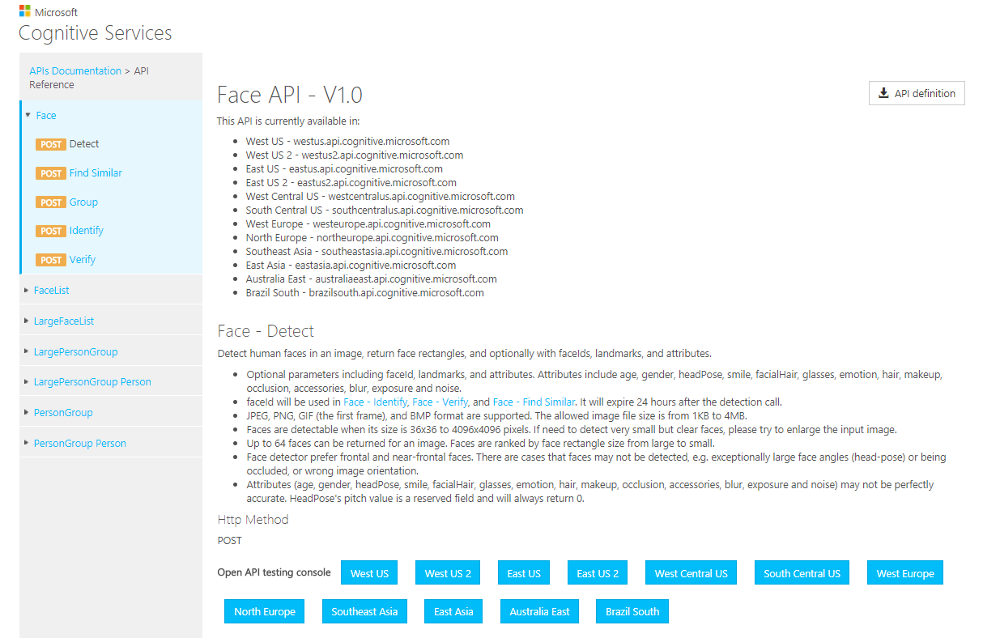

2. Open API testing console 목록에서 우리가 생성한 리소스가 위치한 **East Asia**를 선택한다. 
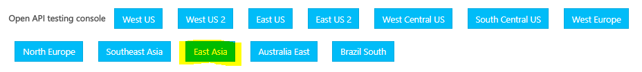

3. [1.Azure Resource Create.md](https://github.com/angie4u/FaceAPI/blob/master/1.%20Azure%20Resource%20Create.md)의 6-3의 Key값을 복사하여 **Ocp-Apim-Subscription-Key**에 붙여 넣는다. 
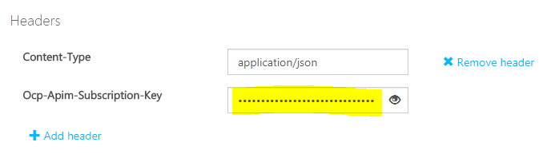

4. Request Body 부분에 유효한 이미지 URL을 붙여넣기 한다. 혹은 아래의 URL을 사용해도 된다. 
    * URL: [https://raw.githubusercontent.com/angie4u/FaceAPI/master/files/%EC%95%88%EA%B2%BD%EC%84%A0%EB%B0%B01.jpg](https://raw.githubusercontent.com/angie4u/FaceAPI/master/files/%EC%95%88%EA%B2%BD%EC%84%A0%EB%B0%B01.jpg) 

    * Body 부분은 다음과 같이 수정하면 된다. 
    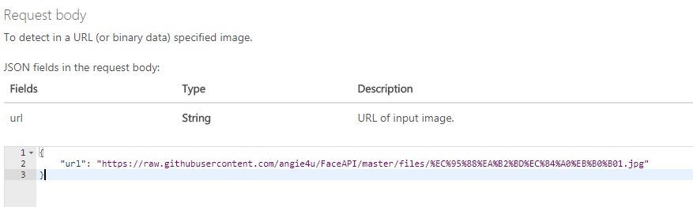

5. **Send** 버튼을 눌러서 결과를 확인한다. Response status 값이 200 OK 이면 성공적으로 전송이 된 것이다. 
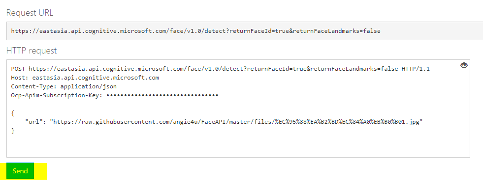
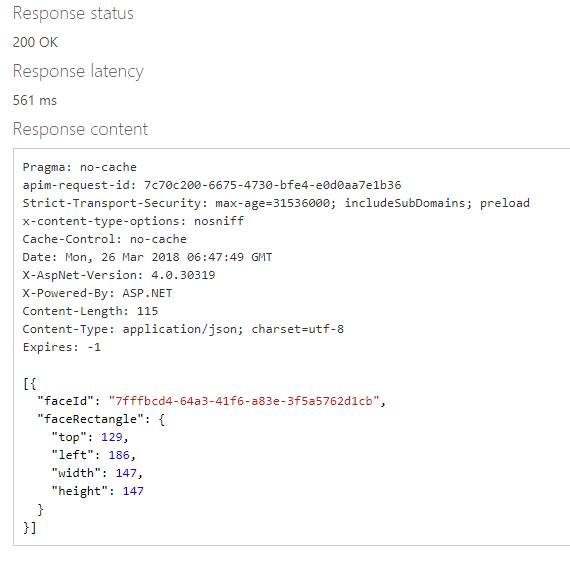

## 2. Postman 이용 
1. Postman을 실행하고 새 탭에 URL 입력칸에 API Testing Console의 **Request URL**의 내용을 붙여넣는다. 
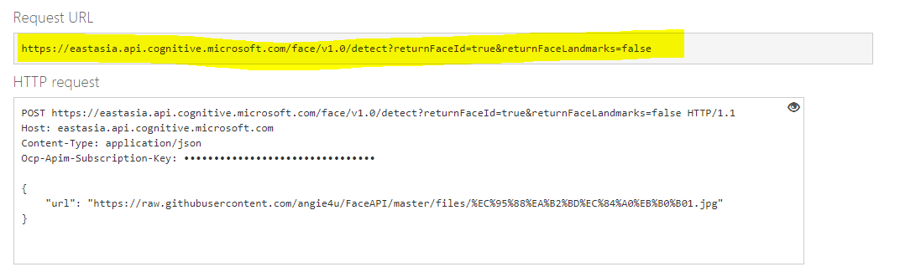
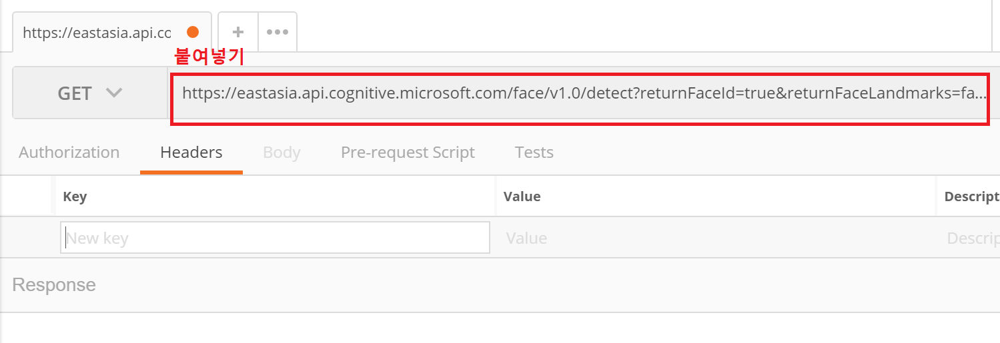

2. HTTP 요청을 **POST**로 바꾸고 Headers 부분에 아래와 같이 추가한다. 
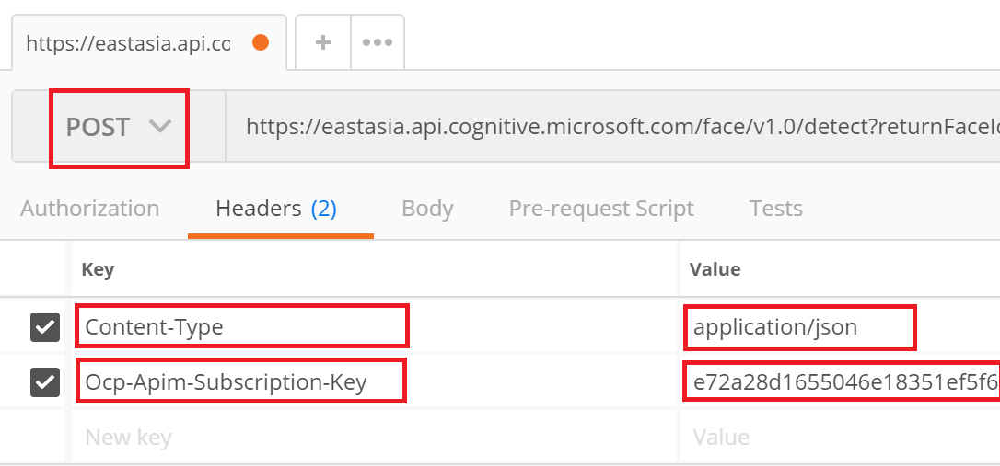

3. Body 탭에서 **raw** 및 **JSON(application/json)**을 선택한 후 **Request body**의 내용을 복사하여 붙여넣는다. 
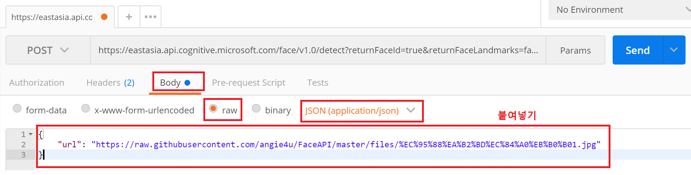

4. **Send** 버튼을 눌러서 전송해보고, API Testing Console에서 진행할때와 결과가 같은지 확인한다. 
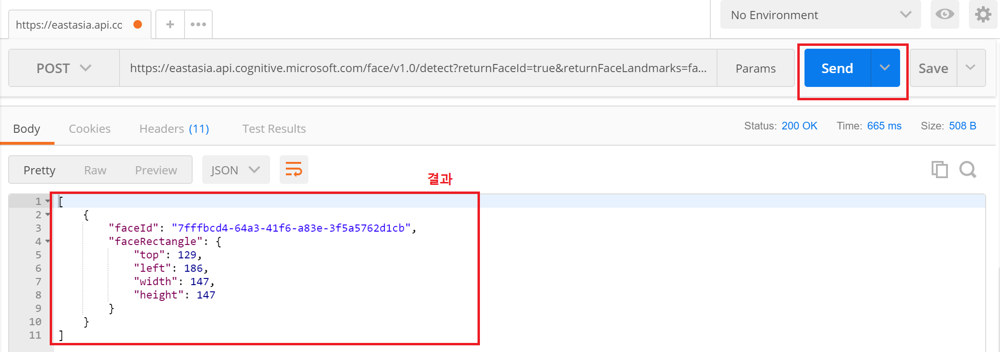