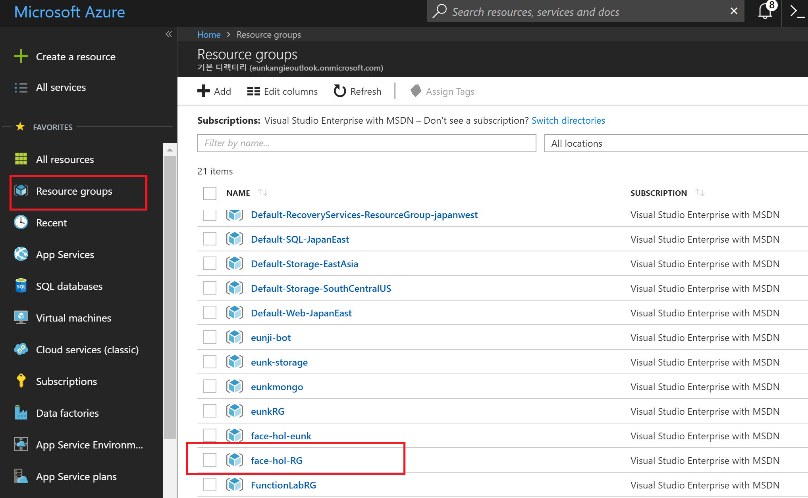
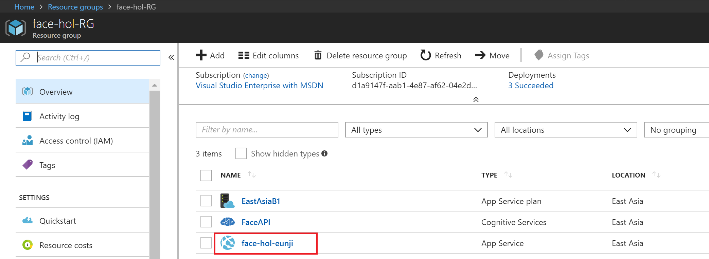
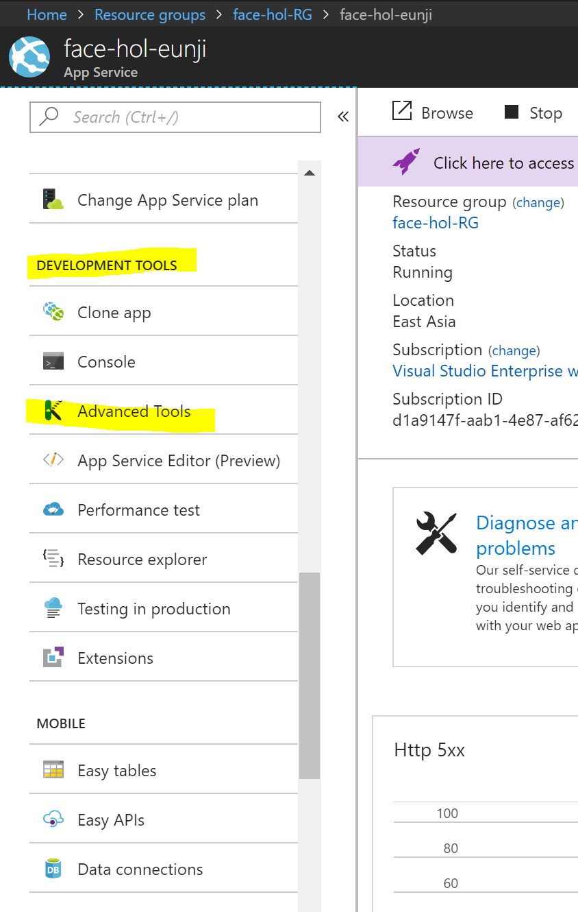
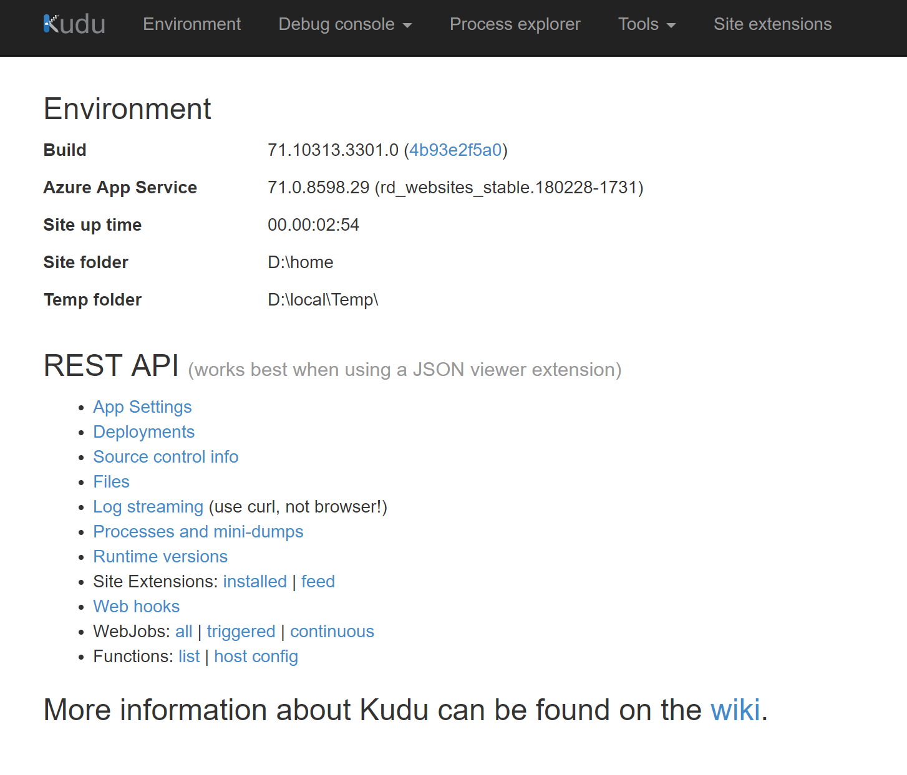
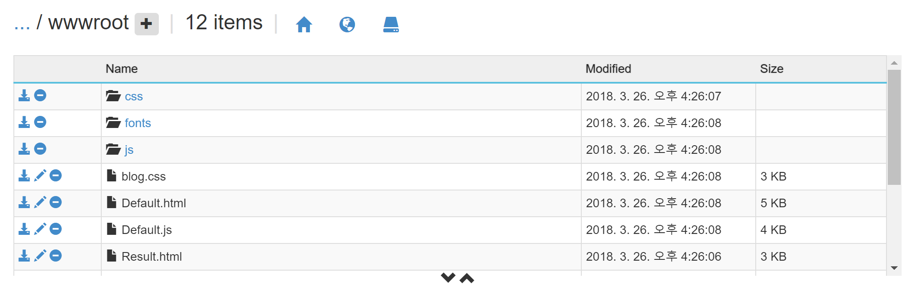
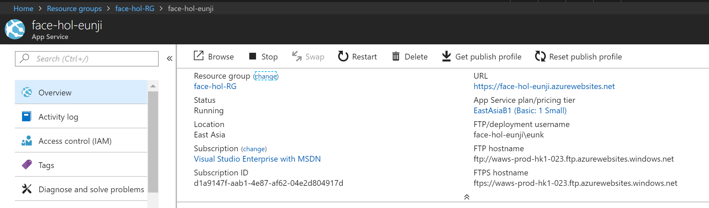
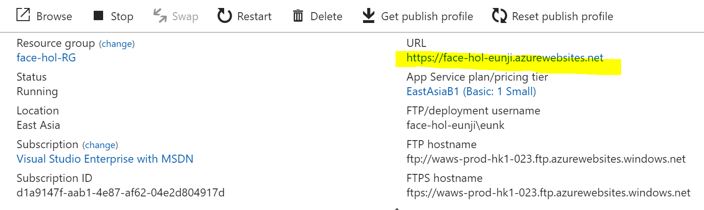
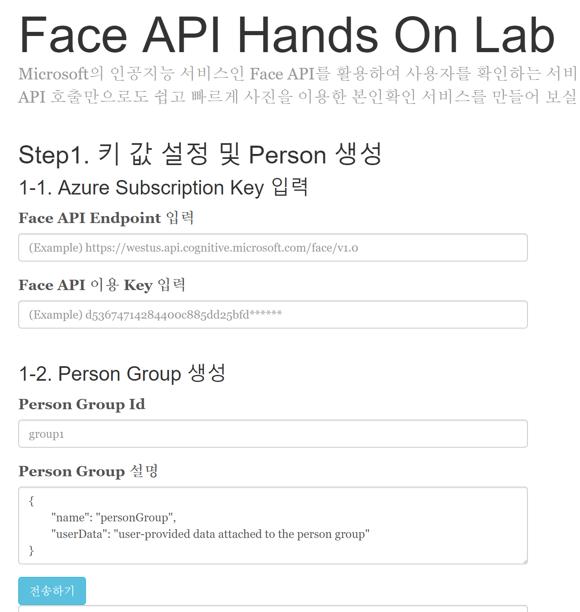

# Deploy to Azure
이번 실습에서는 만든 웹서비스를 Azure Web App에 배포하는 내용을 다룹니다. 

## 1. Web App 접속 및 KUDU 실행, 파일 업로드
1. Azure Portal에 접속 후, 좌측 상단의 **Resourcec groups** 선택 -> **face-hol-RG** 리소스 그룹을 클릭한다.  

2. 리소스 그룹 목록에서 **face-hol-자신의이니셜**를 선택한다.

3. 목록에서 아래쪽으로 스크롤하여 **DEVELOPMENT TOOLS** 부분에 **Advanced Tools**를 클릭한다. 

4. **go** 버튼을 누르면 새창이 열리면서 Web App을 관리할 수 있는 페이지가 로드 된다. 

5. 상단의 탭에서 **Debug console -> CMD**를 차례로 선택하여 아래 페이지에 접속한다. 

6. **site -> wwwroot** 폴더를 차례대로 선택하여 다음의 디렉토리로 이동한다. 

7. 연필모양 아이콘 옆의 마이너스(-) 아이콘을 클릭하여 **hostingstart.html** 파일을 지우고, [src 폴더 하위의 파일](https://github.com/angie4u/FaceAPI/tree/master/src)을 전부 드래그앤 드롭하여 복사한다. 완료후 모습은 다음과 같다. 

## 2. 웹 서비스 접속 및 테스트 
1. 위에서 했던 1-2과정을 참고하여 본인이 만든 Web App 관리 페이지에 접속한다. 

2. **URL**을 클릭하여 Azure Web App 주소로 접속해본다. 위에서 배포한 서비스를 사용해볼 수 있다. 

