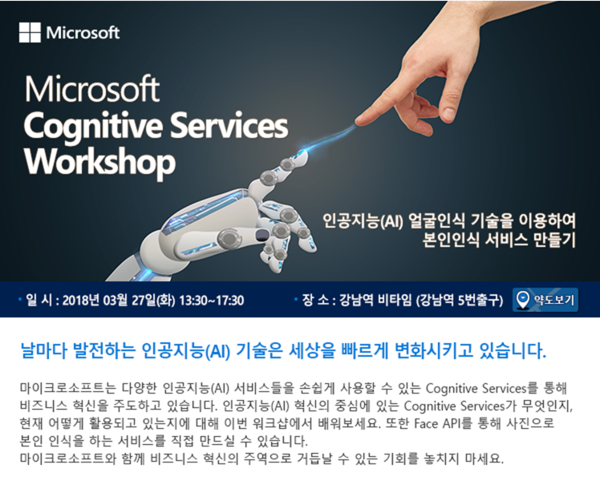

# Cognitive Services를 이용하여 본인인식 서비스 만들기

이번 실습에서는 마이크로소프트의 인공지능 서비스인 Cognitive Services를 이용하여 본인인식 서비스를 만들어 볼 예정입니다. 
Cognitive Services 중에서도 Face API를 이용하여 쉽고 간단하게 Face Verification 서비스를 만들고, Azure에 배포해봅니다. 

* [Cognitive Services 소개](https://azure.microsoft.com/ko-kr/services/cognitive-services/)
* [Face API 소개](https://azure.microsoft.com/ko-kr/services/cognitive-services/face/)

Azure 리소스 및 설치 파일과 관련하여 안내사항은 [Settings.md](https://github.com/angie4u/FaceAPI/blob/master/Settings.md)에 안내되어 있습니다.

Microsoft AI 기술에 대한 소개 세션 이후 이어지는 실습세션은 아래 markdown 파일의 순서대로 진행될 예정입니다.
1. [Azure Resource Create](https://github.com/angie4u/FaceAPI/blob/master/1.%20Azure%20Resource%20Create.md)
: 실습에 필요한 Azure Resource들을 생성하는 과정을 안내합니다.
2. [API Test](https://github.com/angie4u/FaceAPI/blob/master/2.%20API%20Test.md)
: Face API를 API Testing Console과 Postman을 이용하여 사용하는 방법을 간략히 소개합니다.  
3. [Deploy to Azure](https://github.com/angie4u/FaceAPI/blob/master/3.%20Deploy%20to%20Azure.md)
: 완성된 소스코드를 Azure Web App에 배포하는 과정을 안내합니다. 

행사와 관련하여 자세한 정보가 필요하신 분들은 아래의 온오프믹스 이벤트 페이지 링크에서 확인하실 수 있습니다. 
* [https://onoffmix.com/event/130375](https://onoffmix.com/event/130375)

    
    

