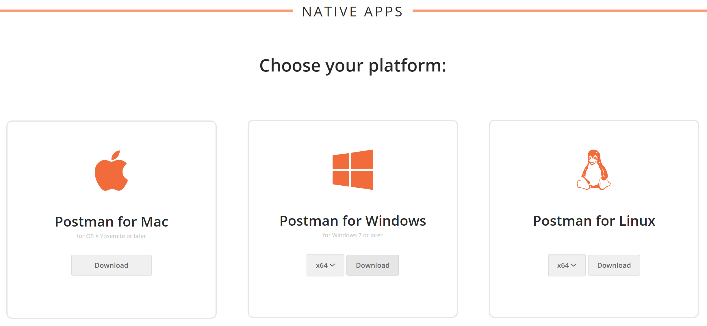
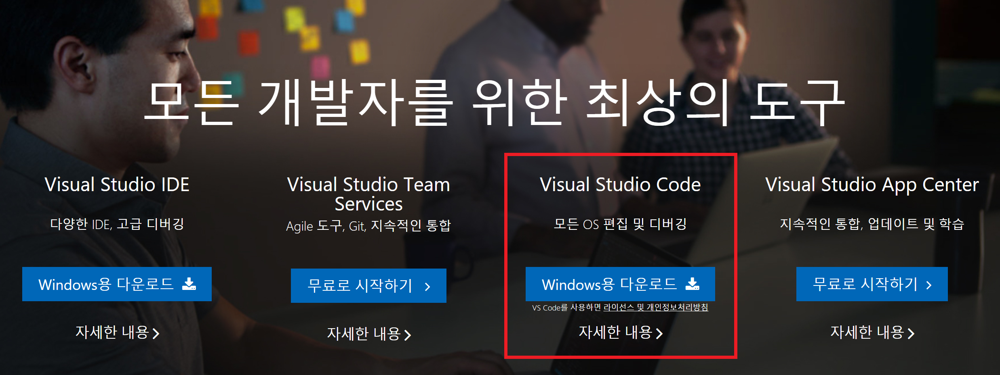
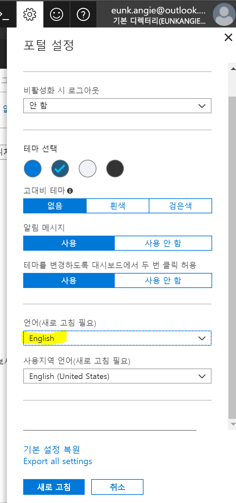
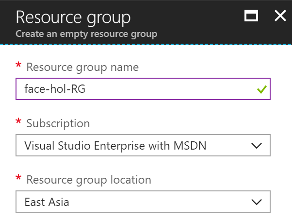
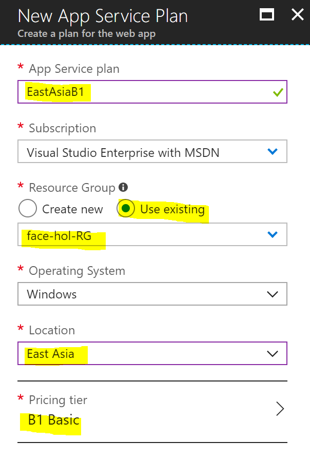
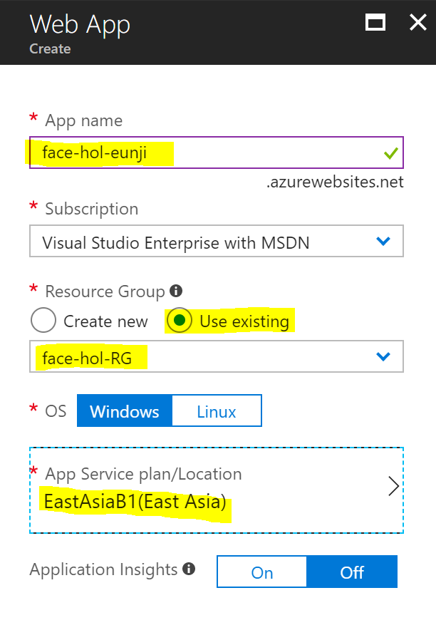
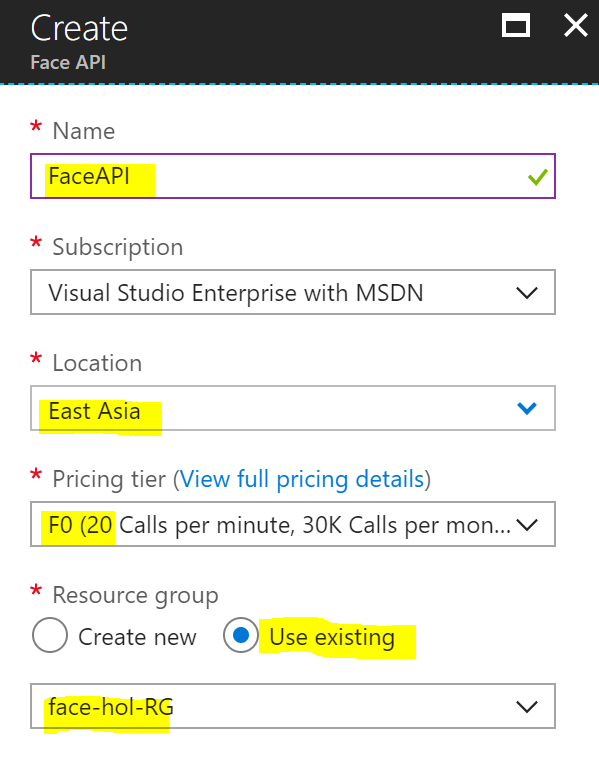

# 사전 설치사항 점검
## 설치 프로그램
* [Postman](https://www.getpostman.com/apps) : API 테스트 도구

* [Visual Studio Code](https://code.visualstudio.com/?wt.mc_id=DX_841432) : 코드 에디터

* [Chrome 브라우저](https://www.google.co.kr/chrome/index.html) 

## Azure Pass 등록
* aka.ms/azurepass(https://www.microsoftazurepass.com/) 에서 등록 가능 

## Azure 언어설정 
오른쪽 상단 설정버튼 클릭 후 **English**로 지정

## Azure 리소스 
1. Resource Group 생성
    * Name: **face-hol-RG**
    * Location: **East Asia**

    
2. App Service Plan 생성
    * App Service Plan: **EastAsiaB1**
    * Location: **East Asia** 
    * Pricing tier: **B1 Basic**

    
3. Web App 생성 
    * App name: **face-hol-자신의이니셜**
    * App Service plan/Location: **EastAsiaB1**

    
4. Face API 생성
    * Name: **FaceAPI**
    * Pricing tier: **F0**

    

